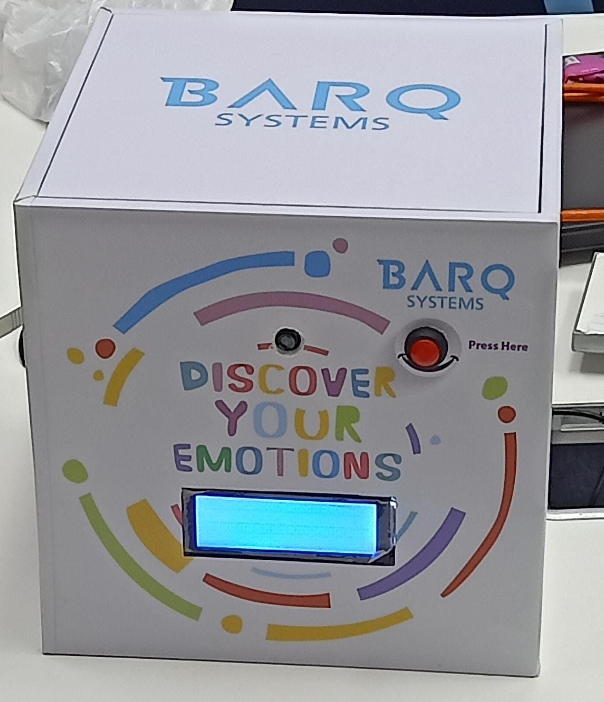
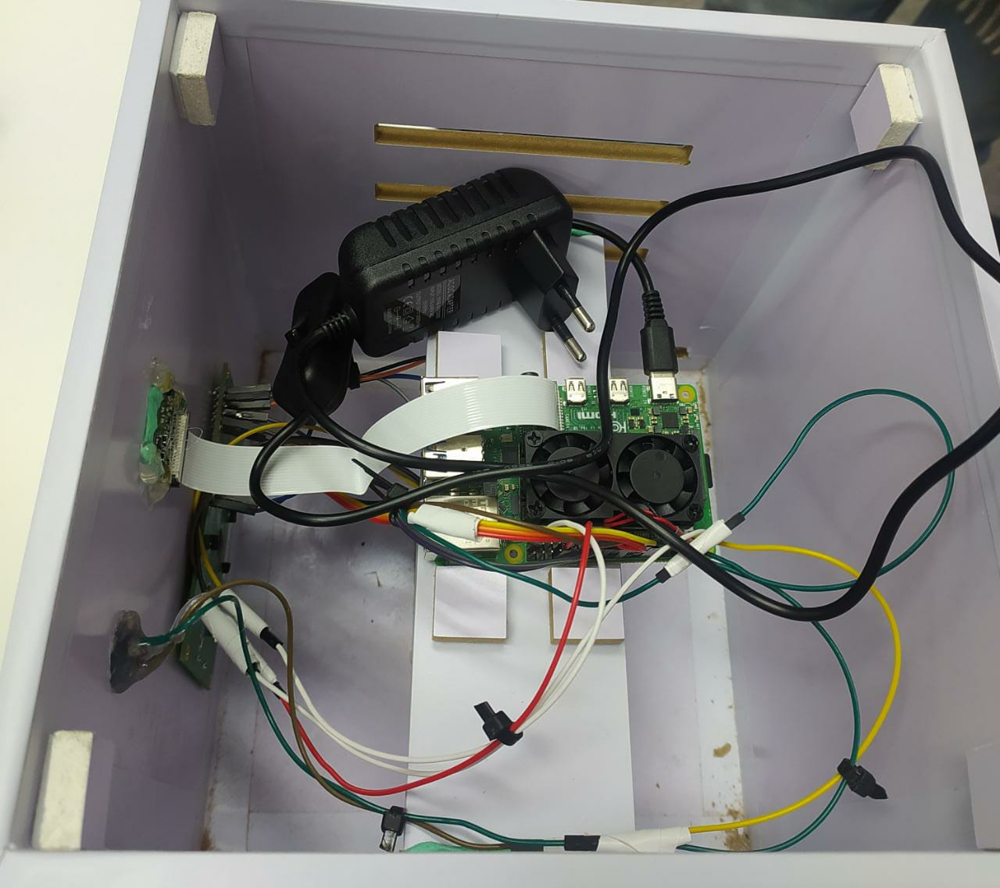

# Real-Time-Facial-Emotion-Recognition
Most of the human feelings are expressed through the face and by seeing one’s face, one can easily  identify whether he is happy or sad or angry. So, for truly knowing the feeling behind words, the facial  expression must be correctly recognized. Facial expression extracts the true or inner emotion which  the speaker tries to hide and find out whether he is happy/sad/angry/neutral/surprised. Its  applications include human behavior detection, human-computer interaction, security, lie detection,  pain detection, music system based on mood, automated tutoring, expressing through emoticons, etc.

